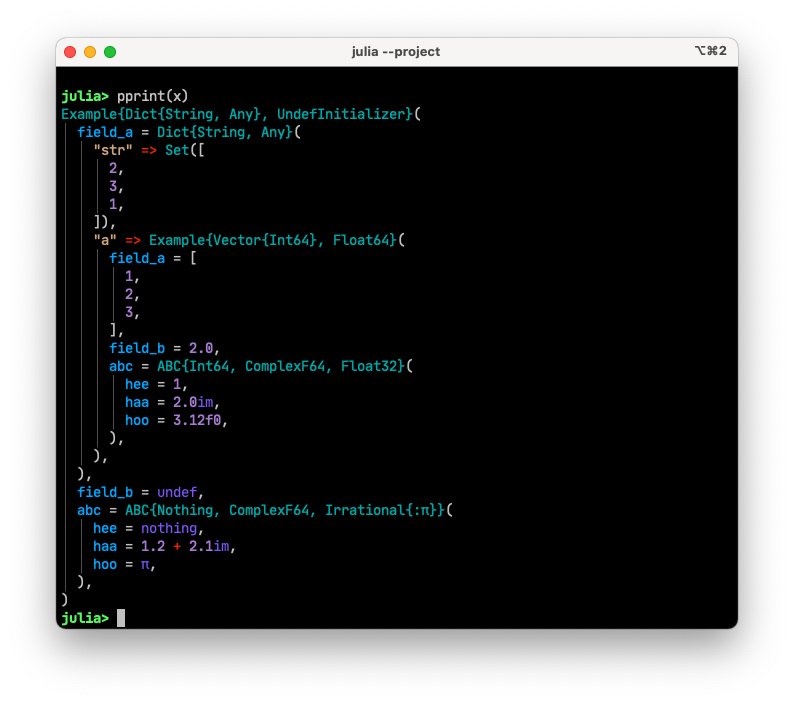

# GarishPrint

[](https://github.com/Roger-luo/GarishPrint.jl/actions)
[](https://codecov.io/gh/Roger-luo/GarishPrint.jl)
[![][docs-stable-img]][docs-stable-url]
[![][docs-dev-img]][docs-dev-url]

An opinioned pretty printing package for Julia objects.

## Installation

<p>
GarishPrint is a &nbsp;
    <a href="https://julialang.org">
        
        Julia Language
    </a>
    &nbsp; package. To install GarishPrint,
    please <a href="https://docs.julialang.org/en/v1/manual/getting-started/">open
    Julia's interactive session (known as REPL)</a> and press <kbd>]</kbd> key in the REPL to use the package mode, then type the following command
</p>

```julia
pkg> add GarishPrint
```

## Usage

there is only one function exported that is `pprint`, here is a quick example

```julia
using GarishPrint

struct ABC{T1, T2, T3}
    hee::T1
    haa::T2
    hoo::T3
end

struct Example{T1, T2}
    field_a::T1
    field_b::T2
    abc::ABC
end

x = Example(
    Dict(
        "a"=>Example(
            [1, 2, 3],
            2.0,
            ABC(1, 2.0im, 3.12f0),
        ),
        "str" => Set([1, 2, 3]),
    ),
    undef,
    ABC(nothing, 1.2+2.1im, π),
)

pprint(x)
```

it will print the following



Please read [documentation][docs-stable-url] for more advanced usage.

## License

MIT License

[docs-dev-img]: https://img.shields.io/badge/docs-dev-blue.svg
[docs-dev-url]: https://Roger-luo.github.io/GarishPrint.jl/dev/
[docs-stable-img]: https://img.shields.io/badge/docs-stable-blue.svg
[docs-stable-url]: https://Roger-luo.github.io/GarishPrint.jl/stable
